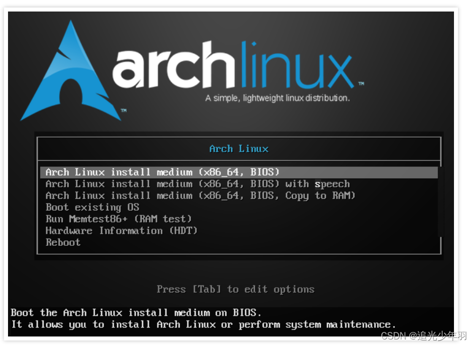
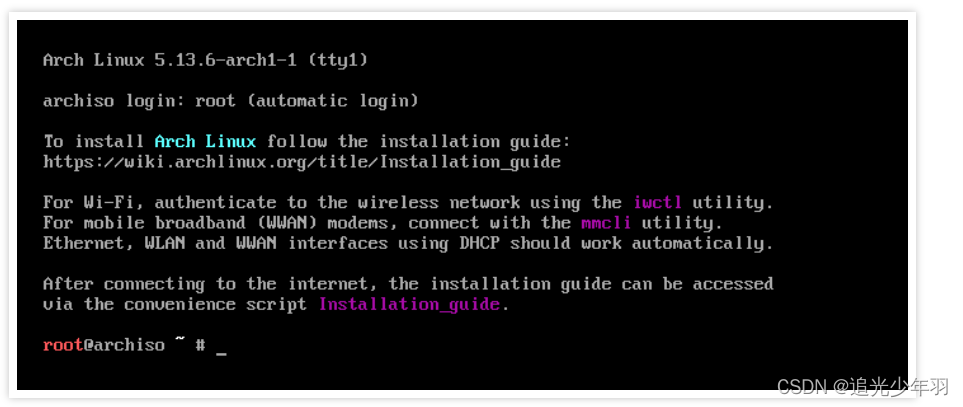
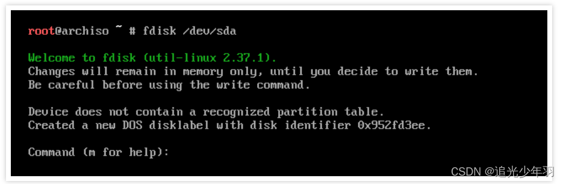
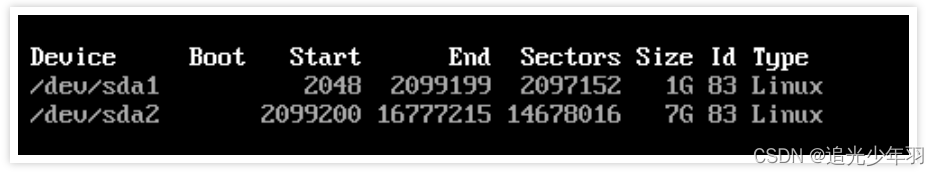

# 桌面级（面向用户）

## Arch Linux系统

#### 准备工作

在开始安装 Arch Linux 之前，需要先下载安装映像文件并创建好虚拟机环境。

#### 下载安装镜像 

下面是 Arch Linux 官方的安装文件下载地址：Arch Linux - Downloads Arch Linux 安装映像下载地址

```bash
https://archlinux.org/download/
```

点击并打开这个页面后，可以看到目前 Arch Linux 最新的版本和下载包的文件信息。

往下翻页，在页面下方有各个国家可用的下载加速镜像。

选择距离自己所在位置最近的加速镜像可以有效提升安装包的下载速度，

我们找到 "China"，然后选择其中一个任意可用的加速镜像地址，比如 163.com。

点击镜像链接后，就会打开一个类似文件列表的页面，

我们选择 iso 后缀的那个文件，直接点击文件名称进行下载操作。

####  创建虚拟机

VMWARE是一个开源免费的虚拟机软件。

下载后安装，创建一个新的虚拟机，并把上面下载的 ISO 文件加载到启动光盘。

启动虚拟机，一切操作正常的话，开机后会看到如下画面：



 通过上下方向键可以自由选择相关的菜单。选择第一项

```bash
Arch Linux Install medium (x86_64, BIOS)
```

按回车键确认，进入 Arch Linux 的安装环境。

#### 磁盘分区

开始正式安装系统前，需要先对硬盘做分区操作。这需要指定可操作的硬盘，可以通过以下命令来确定当前系统有哪些可用的硬盘设备：

```bash
fdisk -l
```

命令会返回类似如下的输出结果：



 其中 /dev/sda 就是一个可用的硬盘设备。记下这个名称，等下分区时会用的上。

在正式开始分区前，需要先确定好分区规划。对于正式使用的场景，

我会建议你多参考一些 Linux 分区方案，可以使日后在磁盘的利用方面更加妥当。

不过对于本文仅做体验的场景，我自己的方案如下：

一个交换分区，大小为 1 GiB。最后所有的空间都留给根分区。

有了分区方案，输入以下命令开始分区操作：

```bash
fdisk /dev/sda
```

命令执行后，会进入如下界面：



 这就是 fdisk 提供的分区操作界面了，通过如下操作来创建一个 1 GiB 的交换分区：

```bash
输入 n 新建分区。
输入 p 新建主分区。
分区编号输入 1。
开始扇区不用输入，直接回车键进入下一项。
结束扇区输入 +1G。
```

```bash
更新：分区方案换成128m boot 1G swap 剩余为filesystem
进入fdisk 磁盘环境后
p列出所有分区
先分配空间，再用t修改分区类型
改为编号4 boot 编号19 swap
保存w
```

然后用同样的流程完成主分区的创建。这一步的分区号为 2，后面的扇区输入都保持空，

然后直接回车键就可以了，程序会自动分配剩余的所有空间。

以上操作完成后，输入 w 写入分区信息。然后再次输入 fdisk -l 命令，会发现输出信息中多了如下内容：



 这说明分区操作成功了。

#### 格式化分区

硬盘分区后，还需要做格式化操作。Linux 针对不同的分区类型，

提供了有不同的格式化命令。首先来格式化boot分区：

```bash
mkfs.fat -F32 /dev/sda1
mkfs.vfat -F 32 -n "boot" /dev/sda1
```

接着来格式化swap分区

```bash
mkswap /dev/sda2
```

主分区使用 ext4 格式的分区：

```bash
mkfs.ext4 /dev/sda3
```

#### 挂载分区

完成分区格式化后，接下来需要挂载分区。首先挂载根分区：

```bash
mount /dev/sda2 /mnt
```

然后启用交换分区：

```
swapon /dev/sda1
```

先创建路径，然后将boot分区挂载至/mnt/boot/efi

```
再次使用mount sda？也就是efi分区为 /mnt/boot/efi
示例： mount /dev/sda1 /mnt/boot/efi
```

#### 安装系统（软件）

完成了以上磁盘操作步骤，就可以正式开始安装 Arch Linux 系统了。

不过开始之前，为了提升安装包的下载速度，可以通过以下命令自动更新并保存 5 个速度最快的软件包镜像加速地址：

```
reflector \
    --save /etc/pacman.d/mirrorlist \
    --country China \
    --protocol https \
    --latest 5
```

然后安装基础软件包，Linux 内核，常见硬件的固件和常用软件工具：

```
pacstrap /mnt base linux linux-firmware vim nano sudo curl wget git reflector networkmanager iwd dhcpcd
```

```
其他软件包：wqy-zenhei rxvt-unicode google-pinyin axel nemo
```

```
桌面环境： xorg-server sddm xorg-xinit terminator i3 openssh
```

```
CPU指令集
pacman -S intel-ucode 
pacman -S amd-ucode 
```

```
记得打开sddm自启动
sudo systemctl enable sddm
```

```
<<<[显卡驱动]>>>
[英特尔核显]
sudo pacman -S mesa lib32-mesa vulkan-intel lib32-vulkan-intel
[AMD核显]
sudo pacman -S mesa lib32-mesa xf86-video-amdgpu vulkan-radeon lib32-vulkan-radeon
[英伟达独显]（若有）
sudo pacman -S nvidia nvidia-settings lib32-nvidia-utils
[双显卡切换工具]
yay -S optimus-manager optimus-manager-qt
sudo systemctl enable optimus-manager
<<<[显卡信息查看]>>>
[NVIDIA独立显卡]
nvidia-settings
[AMD 独立显卡]
yay -S radeon-profile-git radeon-profile-daemon-git
systemctl enable --now radeon-profile-daemon.service
```

#### 挂载文件系统

等待安装完成。结束后，生成新的自动挂载文件，并写入到新安装的系统：

```
genfstab -U /mnt >> /mnt/etc/fstab
```

复制.bashrc文件到新系统（可选）：

```
cp ./.bashrc >> /mnt/etc/root/.bashrc	(未尝试！！！自行验证)
```

然后进入到新安装的系统：

```
arch-chroot /mnt
```

接下来，将开始对新系统做配置操作。

#### 配置 Arch Linux

1.配置网络

安装网络 DHCP 动态 IP 软件包和网络管理软件包：

```
pacman -S dhcpcd networkmanager
```

启用相关服务：

```
systemctl enable dhcpcd
systemctl enable NetworkManager
```

2.配置时区

Arch Linux 默认为 UTC 时区，调整为国内时区使用下面的命令:

```
ln -sf /usr/share/zoneinfo/Asia/Shanghai /etc/localtime
```

3.配置本地字符编码

```
编辑 /etc/locale.gen 文件，取消 en_US.UTF-8 UTF-8 这一行前的注释信息。
执行 locale-gen 命令生成本地字符集信息。
创建 /etc/locale.conf 文件，内容为：LANG=en_US.UTF-8。
使用 en_US.UTF-8 而不使用中文字符编码的原因是为了避免系统输出无法显示的中文信息，以方便排查问题。
```

4.配置用户

> 设置 root 账号密码：
>
> ```
> passwd
> ```
>
> 添加新的普通用户，并加入到 wheel 用户组，以方便使用 sudo 命令来执行一些需要超级用户权限的操作：
>
> ```
> useradd -m -G wheel -s /bin/bash %username%
> ```
>
> 后面的%username%为新用户名称，需要自己定义。
>
> 编辑 /etc/sudoers 文件，移除 # %wheel ALL=(ALL) ALL 这一行前的井号，
>
> 使 wheel 用户组的用户都可以正常执行 sudo 命令。
>
> 给新用户设置密码：
>
> ```
> passwd %username%
> ```

5.配置系统引导程序

安装 GRUB 启动加载器：

```
pacman -S grub
```

安装 GRUB 引导信息至指定的硬盘：（注意，是硬盘，不是分区）

```
grub-install --recheck /dev/sda
```

生成并写入 GRUB 配置信息：

```
grub-mkconfig -o /boot/grub/grub.cfg
```

**tips：如果这里失败了，可能是因为你的分区，没有很好的挂载**

```
首先确保120m的空间格式为fat32
mkfs.vfat -F 32 -n "boot" /dev/mmcblk1p1
需要安装软件包 dosfstools [1]
pacman -S dosfstools
其次在mount sda？也就是主空间为 /mnt后
再次使用mount sda？也就是efi分区为 /mnt/boot/efi
注意，以上目录需要先创建好
然后再使用arch-chroot进入系统
这样就可以正确安装grub2了
```

**安装多操作系统的引导**

```text
pacman -S grub efibootmgr  intel-ucode os-prober
% intel-ucode: 厂家为电脑的cpu更新驱动 update：这是intel cpu的微指令
% amd的cpu 就安装amd-ucode
% grub: 上边说过了，不多讲了
% efibootmgr: efibootmgr被grub脚本用来将启动项写入NVRAM
% osprober： 发现windows操作系统的引导
```

#### 登录新系统

完成以上步骤后，Arch Linux 的基础安装工作就完成了，可以尝试退出安装环境并进入新系统。

首先输入以下命令退出 chroot 环境：

```
exit
```

然后卸载之前挂载的分区：

```
umount -R /mnt
```

把挂载的安装镜像文件取消，然后重新启动系统。

=====**安装完成**=====

这里需要注意新安装的archlinux没有桌面环境以及窗口管理，这些需要自己安装

## Debian系统

#### 准备工作

在开始安装 Debian Linux 之前，需要先下载安装映像文件并创建好虚拟机环境。

#### 下载安装镜像 

下面是 Debian Linux 官方的安装文件下载地址：Debian - Downloads Debian 安装映像下载地址

```
https://www.debian.org/
https://www.debian.org/download.zh-cn.html
```

点击并打开这个页面后，可以看到目前 Arch Linux 最新的版本和下载包的文件信息。

我们直接点击文件名称进行下载操作。

## Ubantu系统

## Deepin系统（深度）


# 服务器级（面向服务）

## CentOS系统

## RHEL系统（Red Hat）

## Rocky Linux

## AlmaLinux OS

## 龙晰（Anolis OS）

## 欧拉（OpenEuler）


# 信创类（面向信创需求）

## OpenEuler

## AnolisOS、

## 银河麒麟

银河麒麟高级服务器操作系统

## 统信（a版 或 e版）

统信服务器操作系统（a版 或 e版）

## 中标

中标服务器操作系统 


# 额外配置

## 关闭蜂鸣器

**临时关闭**

```
sudo rmmod pcspkr
```

**永久关闭**

```
sudo nano /etc/modprobe.d/blacklist.conf
添加并重启
blacklist pcspkr
```

## 设置终端字体默认大小

```
编辑
/etc/vsconsole.conf
加入并重启
FONT=sun12x22.psfu.gz
```

## 开机默认进入命令行或者图形界面

```
命令行
sudo systemctl set-default multi-user.target
图形界面
sudo systemctl set-default graphical.target
```

## 无法连接中文wifi

```
使用iwctl工具，使用具有中文环境的终端连接ssh，在ssh的控制台打开iwctl就可以连接了
```

```
使用nmtui工具，直接选择wifi输入密码进行连接
```

## 无法拨号

```
使用nmtui工具，安装networkmanager工具包
选择新建连接，新建拨号连接后选择使用即可
```

## 中文输入法（多语言）

```
sudo pacman -S fcitx5-im								     ## 安装基础包组
sudo pacman -S fcitx5-chinese-addons                         ## 安装官方中文输入法
sudo pacman -S fcitx5-anthy                                  ## 安装日文输入法
sudo pacman -S fcitx5-pinyin-moegirl                         ## 安装萌娘百科词库
sudo pacman -S fcitx5-material-color                         ## 安装输入法主题
sudo pacman -S fcitx5-pinyin-zhwiki 
sudo pacman -S fcitx5-im fcitx5-chinese-addons fcitx5-anthy fcitx5-pinyin-moegirl fcitx5-material-color fcitx5-pinyin-zhwiki
```

```
nano ~/.xprofile	## 编辑配置文件（不存在则创建）
添加后重启
GTK_IM_MODULE DEFAULT=fcitx5
QT_IM_MODULE DEFAULT=fcitx5
INPUT_METHOD DEFAULT=fcitx5
XMODIFIERS DEFAULT="\@im=fcitx5
SDL_IM_MODULE DEFAULT=fcitx
```

