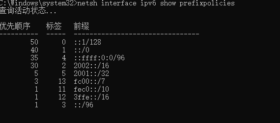
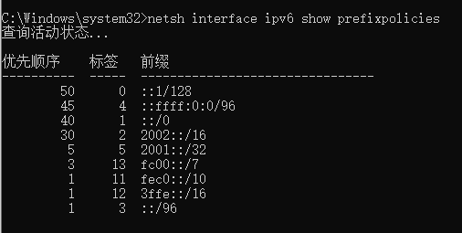
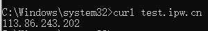

在window中，开启了ipv6后，会导致ipv6优先级高

##### 查看优先级

使用命令

```text
netsh interface ipv6 show prefixpolicies
```

查看优先级，需要管理员权限



##### 网络前缀含义

我们依次介绍下这些前缀的含义。

- `::1/128`：本地回环地址，类似 IPv4 中的 127.0.0.1
- `::/0`: IPv6 单播地址
- `::ffff:0:0/96`: IPv4 地址范围
- `2002::/16`: 6to4，具体详见 [RFC3056: Connection of IPv6 Domains via IPv4 Clouds](https://www.rfc-editor.org/rfc/rfc3056.html)
- `2001::/32`: TEREDO，具体详见 [RFC4380: Teredo: Tunneling IPv6 over UDP through Network Address Translations (NATs)](https://www.rfc-editor.org/rfc/rfc4380.html)
- `fc00::/7`: Unique-Local，具体详见 [RFC4193: Unique Local IPv6 Unicast Addresses](https://www.rfc-editor.org/rfc/rfc4193.html)
- ...

##### 修改优先级

从前面我们知道 IPv6(`::/0`)比 IPv4(`::ffff:0:0/96`) 的优先级高，我们通过 `netsh interface ipv6` 命令调整优先级。

```text
netsh interface ipv6 set  prefixpolicy ::ffff:0:0/96 [优先级] [标签]
```

默认情况下我们使用

```
netsh interface ipv6 set  prefixpolicy ::ffff:0:0/96 45 4
```

在不修改标签的情况下，将

`::ffff:0:0/96`: IPv4 地址范围 

优先级上调至

`::/0`: IPv6 单播地址

前面，也就是45



这样就成功了

再次测试

```bash
curl test.ipw.cn
```

结果

