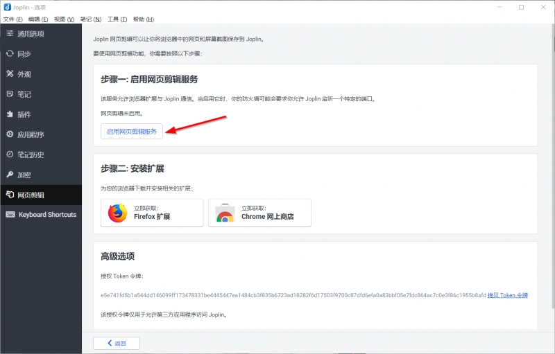
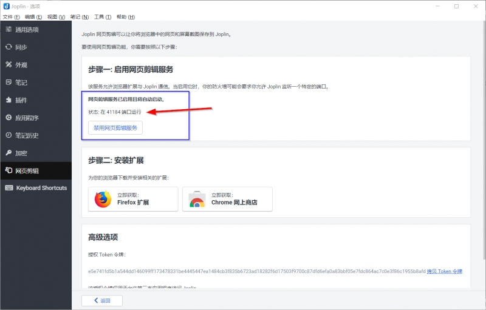

在文章Joplin免费开源的笔记软件，安装和坚果云同步配置中已经讲解了如何安装Joplin和使用坚果云同步我们的笔记，在文章使用Typora作为Joplin的外部编辑器教程中我们也介绍了如何使用界面更加漂亮的Typora和Joplin进行互补，达到令人赏心悦目的文章书写体验，这篇文章我们主要讲解如何使用Joplin进行文章的剪切和收藏。

首先我们说一下什么是网页文章剪切和收藏。所谓的网页文章剪藏，就是当我们在网页上看到非常好的文章的时候，觉得它非常有收藏的价值，这个时候我们一般会有两种选择，一种是保存书签，第二种是将文章复制下来。第一种方法些缺陷，如果我们想要修改一下原文怎么办？万一哪天文章被删除了怎么办？所以第二种方法将文章复制下来就要显得靠谱些。Joplin官方也是提供了网页收藏功能的，下面我们好好聊聊具体的操作步骤！

### 安装Joplin浏览器剪藏插件

Joplin的文章剪藏功能需要浏览器插件的支持，所以首先我们需要先安装插件。Joplin的浏览器插件有Chrome和Firefox版本。对于Chrome，在插件市场搜索Joplin即可找到，但是国内因为某些原因可能某些小伙伴不能访问插件市场，我这里已经给大家下载好了，大家可以点这里下载(访问密码：59b0 )。下载完成后就需要我们在浏览器里面安装插件，Chrome插件的离线安装这里已经有一篇教程，这里我就不再赘述了！安装完成之后Chrome浏览器的右上角应该会出现一个含有字母J的图标，如果没有那么说明可能你没有启用插件，在浏览器的插件管理器里面找到Joplin Web Clipper插件然后点击启用按钮即可（启用后按钮应该是蓝色的，没启用是灰色的）。

对于Firefox，直接在插件市场搜索Joplin就可以搜索到，然后点击安装即可安装完成。

### 使用Joplin剪藏文章

好了，现在该安装的都安装好了，我们开始讲解如何使用Joplin进行文章剪藏。首先打开我们的Joplin，点击菜单栏的**工具**，然后在弹出菜单中选择**选项->网页剪藏**，然后点击**启用网页剪辑服务**

点击启用网页剪辑服务

然后你会看到如下的界面，表示我们启用成功

点击启用剪辑服务后

可能Windows的防火墙会弹出提示，点击**允许**即可。好了，现在Joplin设置完成了，我们去剪辑收藏一篇文章试试。因为我用的Chrome浏览器，所以这里就以Chrome为例，FireFox是完全一样的。首先打开我们要收藏的网页：

然后点击右上角我们的插件图标，弹出一个选择框

弹出菜单

下面我一个一个给大家讲讲这里的按钮的意思（按编号来）：

1.  Clip simplified page。顾名思义就是剪藏简化版的文章。所谓的简化版的文章就是文章的主要部分被转化成为了Markdown方便我们编辑；
    
2.  Clip complete page。就是所有的相关的不相关的网页信息全部copy下来，我一般不用这个，用第一个感觉最实用；
    
3.  Clip complete page(Html)。这个按钮是将文章剪切下来，但是不转换为Markdown，不是很方便后期的编辑，但是能最大程度的保持文章原有的排版；
    
4.  Clip selected。这个按钮是用于当我们不想要把整篇文章剪切下来，而是仅仅想要一部分的时候，我们可以先用鼠标在网页上选中我们需要的内容（具体方法是按住鼠标左键在我们想要的内容上一扫，呈现绿底的就是我们选中的内容）；
    
5.  Clip screenshot。使用截图进行剪藏，也就是网页截图啦！点击后然后在网页上圈定我们要的截图部分即可；
    
6.  Clip URL。就是将我们的网页的网址给剪切下来。
    

好了，知道了怎样剪切文章后还要为我们的文章选定要保存的笔记本，在选中了剪切方式后，单击**In Notebook**对应的复选框，在弹出菜单中选中我们要保存的位置，在**Title**项检查修改文章标题后，点击**Confirm**按钮即可保存成功。然后我们去Jopin对应的笔记本文件夹里面就能找到我们刚刚剪切的文章了！

关于其他的Joplin使用教程和技巧，可以翻阅一下这里的文章合集哦！