```
 Win10的更新，并没有像之前的操作系统一样空容易关闭。每次在更新班里面关闭之后，过一段时间又会自动开起来。个人电脑还好，特别是公司的电脑 ，由于很多公司电脑设有打印机共享，系统一更新，打印机共享不能用了，下面通过网上查的一些资料，经过实测。确定可以永久的
```

关闭WIN10的更新。一共通过以下五步来实现。

1. 在windows设置中关闭更新；

2. 关闭windows update 服务；

3. 本地组策略修改，“ 计算机配置 > 管理模板 > Windwos组件 > Windows 更新 ” 然后找到“ 配置自动更新 ”

4. 禁用任务计划，taskschd.msc  路径：**任务计划程序库/Microsoft/Windows/WindowsUpdate** ”

5. 修改注册表：HEEY_LOCAL_MACHINE\SYSTEM\CurrentControlSet\Services\UsoSvc 。Start =4  ；FailureActions


#### 第一步：在Windows设置关闭更新

\1. 按“Windows + i ” 键，打开Windows设置，再单击“更新和安全”。

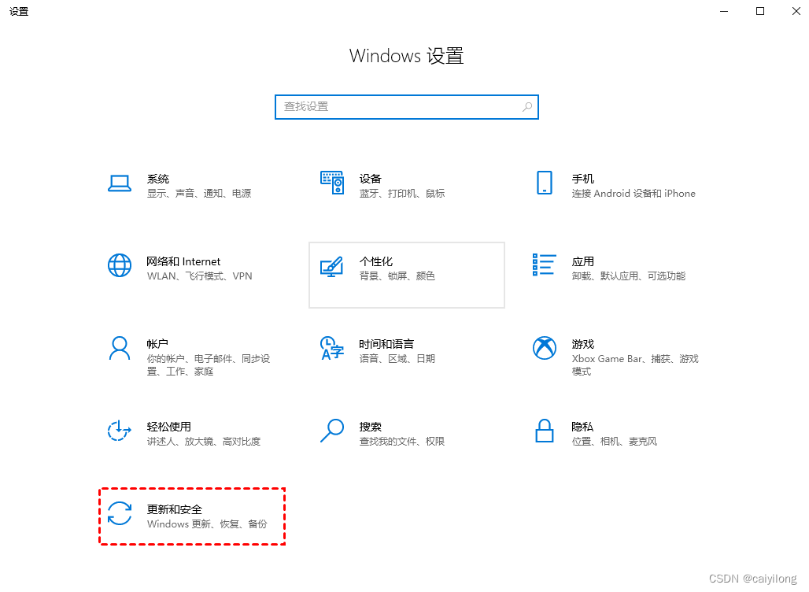


2.然后在Windows更新处，单出“高级选项”。

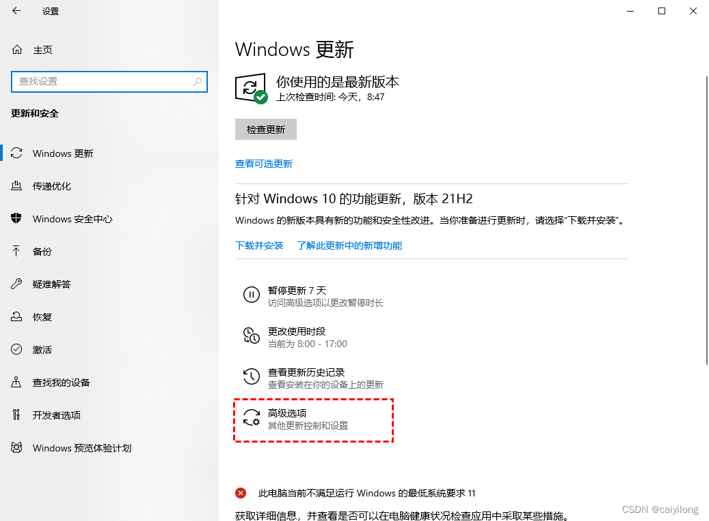

 3.在高级选项中，需要将“更新选项”中的项目全部关闭。

 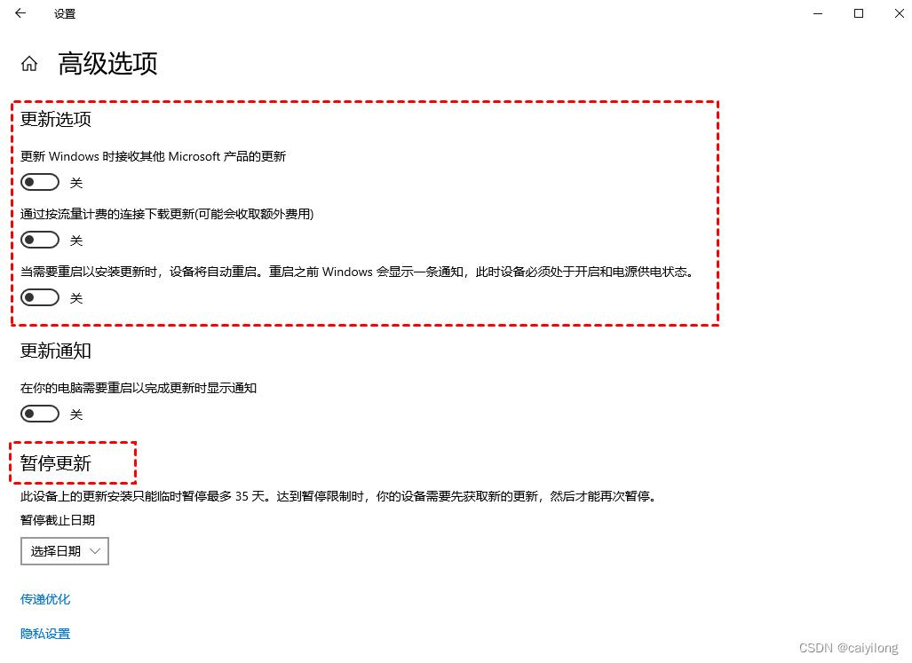

#### 第二步：关闭Windows Update 服务

\1. 按“windows + R” 键，打开运行对话框，并输入“services.msc”,然后点击确定。

 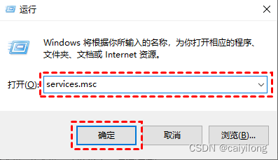

\2. 在弹出的服务窗口中，找到“Windows Update” 选项并双击打开它。

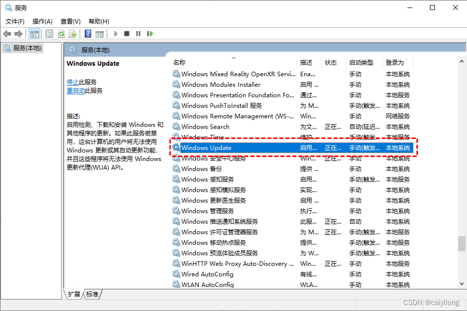

 \3. 在弹出的"**Windows Update属性**"对话框中，将“**启动类型”**设置为“**禁用**”

 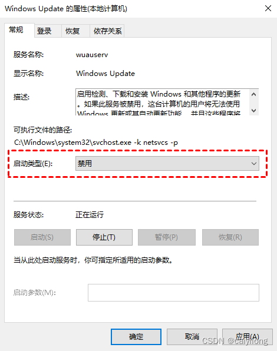

\4. 然后再单击“ **恢复** ” ，将图中框选部分都设置为“ **无操作** ” ， 再单击 “ **应用** ” 和“ **确定** ”。

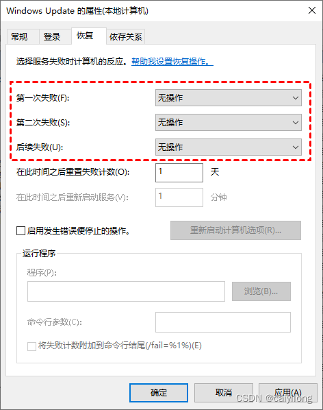

#### 第三步：本地组策略编辑器

 \1. 按“ **Windows + R** ” 键，打开运行对话框，并输入 “ **gpedit.msc** ” ,然后单击 “ **确定** ” 。

 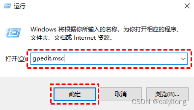

 \2. 在弹出的本地组策略编辑器中，依次单击“ **计算机配置 > 管理模板 > Windwos组件 > Windows 更新** ” 然后找到“ **配置自动更新** ” 并双击打开它。

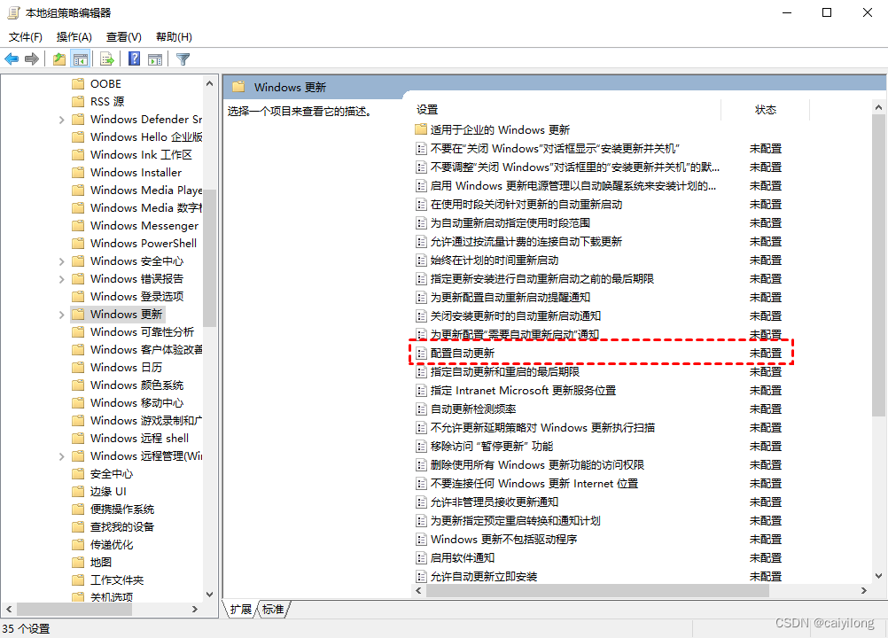

 \3. 在弹出的“ **配置自动更新** ” 窗口中，选择 “ **已禁用** ” 再单击 “ **确定** ” 。

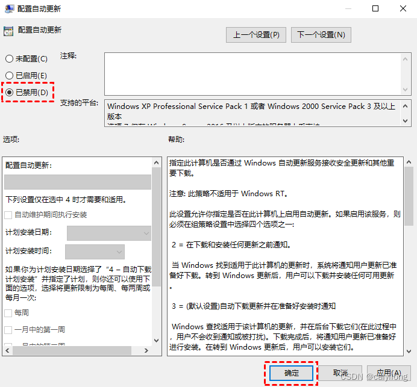

 \4. 然后在“ Windows更新 ” 页面找到“ **删除使用所有Windows更新功能的访问权限** ”，并双击打开它

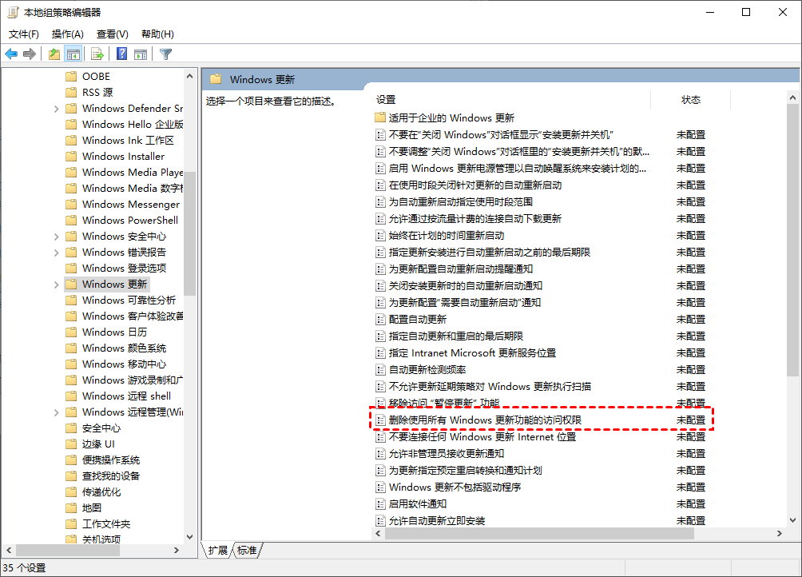

\5. 在弹出的窗口中，再勾选“ **已启用** ” ， 然后单击” **确定** “ 。

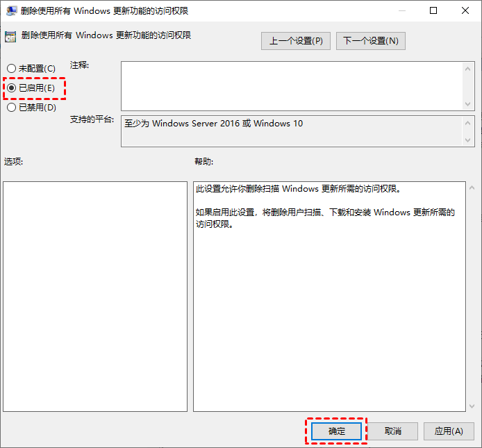

#### 第四步：禁用任务计划的 Schedule Start

\1. 按 “ **Windows + R** ” 键,打开运行对话框，并输入“ **taskschd.msc** ” ,然后再单击 “ **确定** ”。

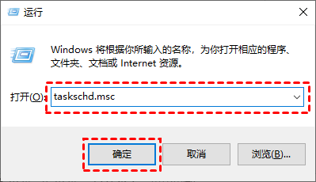

\2. 在任务计划程序窗口中，跳转到该路径“ **任务计划程序库/Microsoft/Windows/WindowsUpdate** ”。

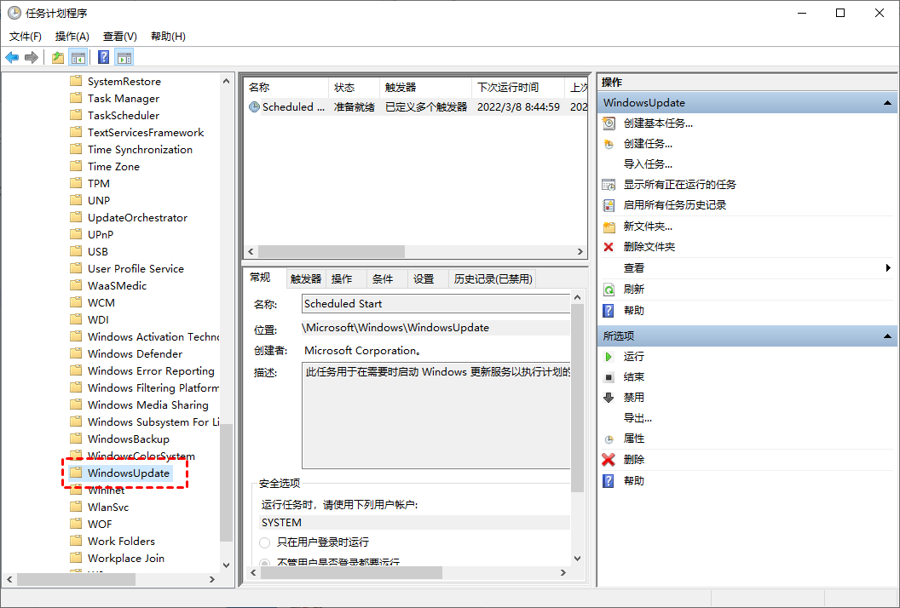

\3. 然后，选中“ **Schedule Start** ”  ，右击选择“ **禁用** ” 。

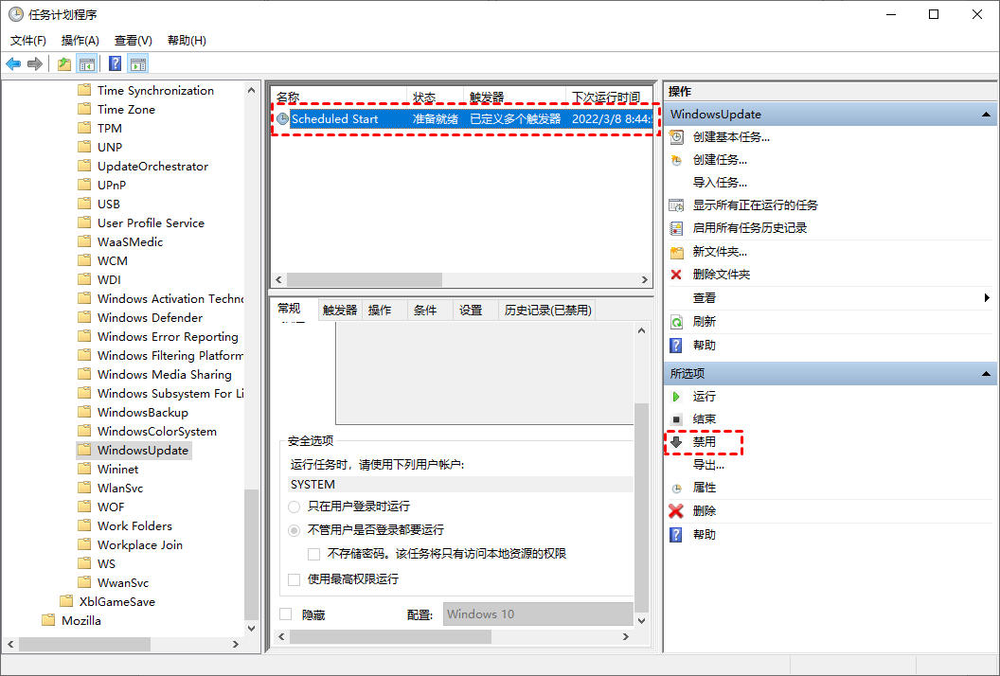

#### 第五步：修改注册表

\1. 按“ **Windows + R** ” ,打开运行对话框，并输入 “ **regedit.exe** ” , 然后单击“ **确定** ” ，在弹出的窗口中点击“ **是** ” 。

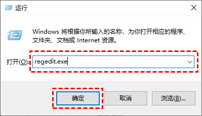

\2. 进入注册表后，跳转到以下路径，并在右侧找到“ **Start** ” 键 ，并双击打开它。
路径：**HEEY_LOCAL_MACHINE\SYSTEM\CurrentControlSet\Services\UsoSvc**

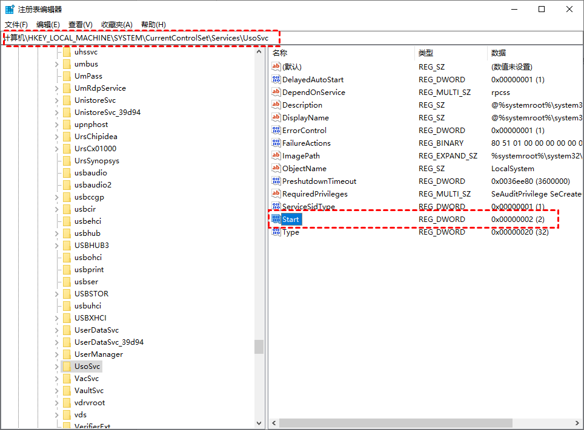

3.在弹出的窗口中将“ **数值数据** ” 改为 “ **4** ” ，并单击“ **确定** ” 。

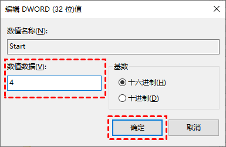

4.然后再找到**“FailureActions”**键并双击进行编辑，将**“00000010”**和**“00000018”**行中的第五个数值，由原来的**“01”**改为**“00”**，再单击**“确定”**。

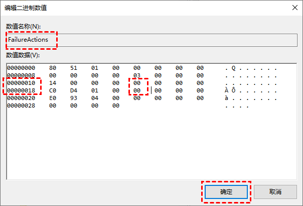

以上的各步，不一定要每一步都要做，或许只做其中的几步就可以，我没有实际测试过。但是每一步都做了的，是确定可以尤其关闭的。